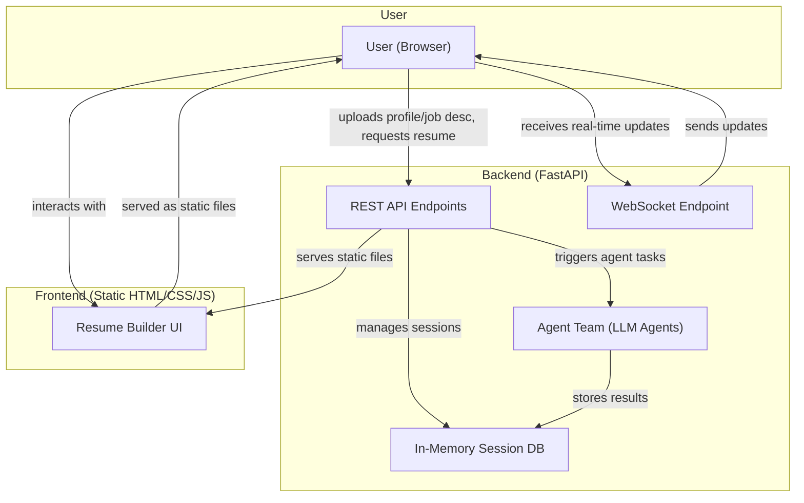

# Agentic Resume Builder



A simple, personal, agent-powered resume builder that helps you generate and refine ATS-friendly resumes based on your profile and job description. Built with FastAPI (Python) for the backend and static HTML/CSS/JS for the frontend.

## 🚀 Project Scope & Purpose
- **Personal project**: Designed for individual use or as a learning resource.
- **Not for production-scale use**: Uses an in-memory database (data is lost on restart).
- **No authentication**: All features are public and session-based.
- **Agentic workflow**: Uses LLM agents to help generate and refine resumes.

## ✨ Features
- Upload your resume/profile and a job description.
- Generate a tailored, ATS-friendly resume in HTML format.
- Refine resumes iteratively with feedback.
- Version history for resumes (per session).
- Real-time updates via WebSocket.
- Simple, static frontend served by the backend.
- **Download your resume as PDF** (browser print-to-PDF supported).

## 🛠️ Getting Started

### 1. Clone the repository
```bash
git clone <your-repo-url>
cd resume-builder
```

### 2. Set up environment variables
Copy the example file and edit as needed:
```bash
cp .env.example .env
```

### 3. Run locally (requires Python 3.9+)
```bash
pip install -r requirements.txt
uvicorn backend.app:app --reload
```
Visit [http://localhost:8000](http://localhost:8000) in your browser.

### 4. Run with Docker (recommended)
```bash
docker-compose up --build
```
- The app will be available at [http://localhost:8000](http://localhost:8000)
- To stop: `docker-compose down`

## 🛡️ Monitoring & Maintenance

- For small/personal projects, console logging is usually sufficient. Logs can be viewed with `docker-compose logs` or `docker logs`.
- For uptime monitoring, consider free tools like [UptimeRobot](https://uptimerobot.com/) or [BetterStack](https://betterstack.com/).
- To keep logs after container restarts, mount a Docker volume and configure Python logging to write to a file (optional).
- To update dependencies, run:
  ```bash
  pip install -U -r requirements.txt
  ```
- Regularly check for security updates to Python and your dependencies.

## ⚙️ Environment Variables
All configuration is via environment variables. See `.env.example` for all options and descriptions. Key variables:
- `ENVIRONMENT` (development/production)
- `FRONTEND_URL` (CORS origin)
- `DEBUG`, `SESSION_TIMEOUT`, etc.

## 📚 API Documentation
- Interactive API docs: [http://localhost:8000/docs](http://localhost:8000/docs)
- ReDoc: [http://localhost:8000/redoc](http://localhost:8000/redoc)

## 📝 Usage Workflow
1. Upload your resume/profile file.
2. Upload a job description.
3. Click "Generate Resume" to get a tailored resume.
4. Refine with feedback as needed.
5. **Download as PDF (use your browser's print-to-PDF feature) or copy the HTML resume.**

## 🩹 Troubleshooting
- **Session errors?** Make sure cookies are enabled and you’re using the same browser tab for all actions.
- **Data lost after restart?** This is expected—data is stored in memory only.
- **CORS issues?** Check your `FRONTEND_URL` and `ENVIRONMENT` settings.
- **Docker issues?** Ensure Docker is running and ports are not in use.

## 🤝 Contributing
This is a personal/learning project, but PRs and suggestions are welcome!

## 📄 License
MIT (see LICENSE file) 

## ⚠️ Legal & Compliance Disclaimer
- This is a personal/learning project and is **not intended for commercial or production use**.
- No user data is stored persistently; all data is lost on server restart.
- If you deploy this app publicly and collect real user data, you are responsible for adding a privacy policy, terms of service, and ensuring compliance with relevant laws (e.g., GDPR). 